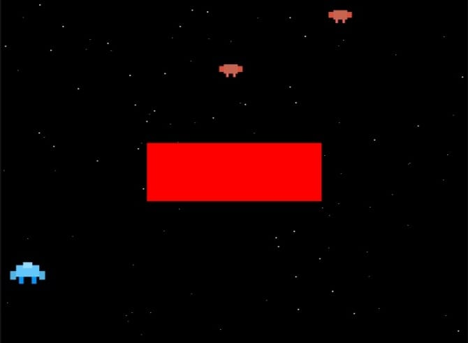
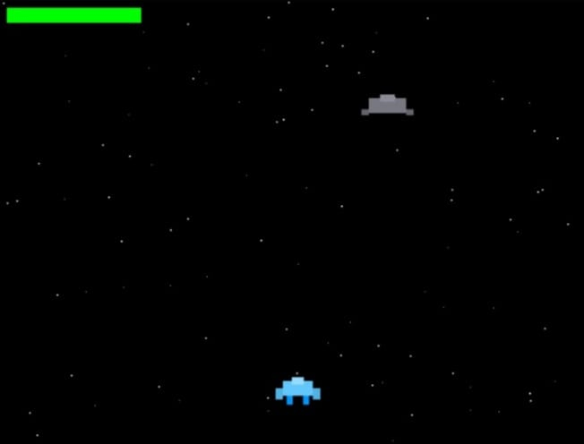
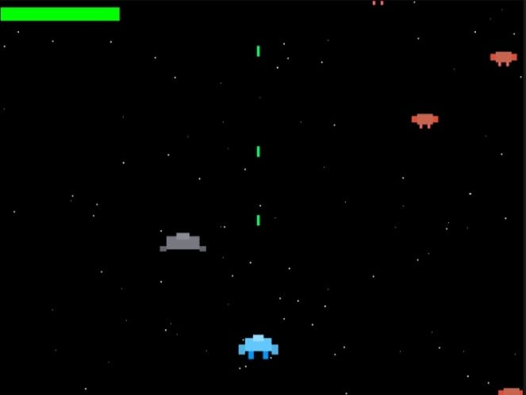

# Space Shooter

A classic arcade-style space war game built with C and SDL2. Battle waves of enemy ships, dodge incoming attacks.

## Gameplay

Control a blue spaceship and defend against waves of enemy fighters and destroyers. Shoot down enemies while avoiding collisions to survive as long as possible.

### Controls
- **Arrow Keys**: Move your ship (Up/Down/Left/Right)
- **Spacebar**: Fire bullets
- **R**: Restart game (when game over)

### Features
- Two enemy types:
  - **Red Fighters**: Fast, agile enemies
  - **Gray Destroyers**: Tougher enemies with 3 health
- Scrolling starfield background
- Health bar system
- Smooth 60 FPS gameplay

## Prerequisites

To build and run this game, you'll need:
- GCC or another C compiler
- SDL2 library installed

### Installing SDL2

**Ubuntu/Debian:**
```bash
sudo apt-get install libsdl2-dev
```

**macOS (with Homebrew):**
```bash
brew install sdl2
```

**Windows:**
Download SDL2 development libraries from [libsdl.org](https://www.libsdl.org/download-2.0.php)

## Building the Game

Compile the game using:

```bash
gcc space_war.c -o space_war -lSDL2 -lm
```

## Running the Game

```bash
./space_war
```

## Game Mechanics

- **Starting Health**: 100 HP
- **Collision Damage**: 10 HP per enemy hit
- **Enemy Spawn Rate**: Every 1.5 seconds
- **Fire Rate**: 5 shots per second (max)
- **Bullet Speed**: 8 pixels/frame upward

## screenshots





## Game Over

When your health reaches zero, a red game over screen appears. Press **R** to restart and try again!

## Troubleshooting

**SDL2 not found during compilation:**
- Make sure SDL2 is properly installed
- Check that SDL2 is in your library path
- Try specifying the SDL2 path explicitly: `-L/path/to/sdl2/lib`

**Window doesn't appear:**
- Verify your graphics drivers are up to date
- Try running with software rendering

## License

This project is open source and available for educational purposes.

## Contributing

Feel free to fork this project and submit pull requests for improvements or bug fixes!

## Future Enhancements

Potential features to add:
- Power-ups (shield, rapid fire, health restore)
- Multiple levels with increasing difficulty
- Boss battles
- Sound effects and music
- High score persistence
- Particle effects for explosions
- Additional enemy types

## Author

Created as a learning project using SDL2 and C.

---

Enjoy the game!
